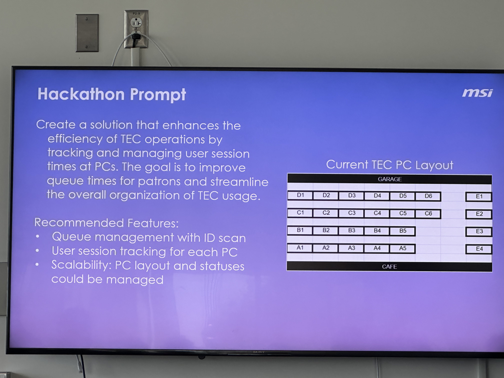
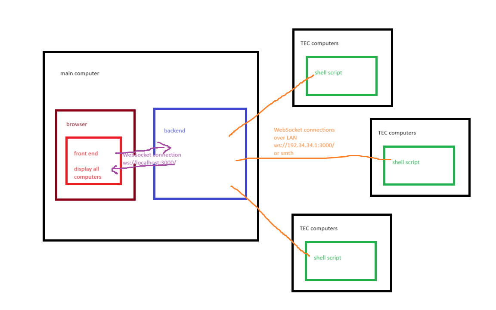

# turbo-fiesta






## Frontend

In [`frontend/`](./frontend/):

```sh
# Install dependencies
$ yarn

# Build to dist/
$ yarn build

# Start local development server
$ yarn dev
```

## Backend

```sh
# Run central server
$ cargo run --bin server

# Run on computer A5
$ cargo run --bin comp A5
```

The `server` starts two WebSocket servers:

- `ws://0.0.0.0:3001/` is for the PCs to tell the server about their idle or use state and games or AI response. The payload looks like this:

  ```json
  {
    "RustInfo": {
      "comp": "A5",
      "idle": false,
      "games": ["Discord", "Half-Life"]
    }
  }
  ```

- or this:

  ```json
  {
    "CsInfo": {
      "comp": "A5",
      "response": "something"
    }
  }
  ```

- `ws://0.0.0.0:3000/` is for the server to communicate with the front-end. The payload looks like this:

  ```json
  {
    "A5": {
      "idle_count": 0,
      "use_count": 101,
      "games": ["Discord", "Half-Life"],
      "response": "something"
    },
    "B5": {
      "idle_count": 0,
      "use_count": 100,
      "games": ["Discord", "Half-Life"],
      "response": "something"
    }
  }
  ```
